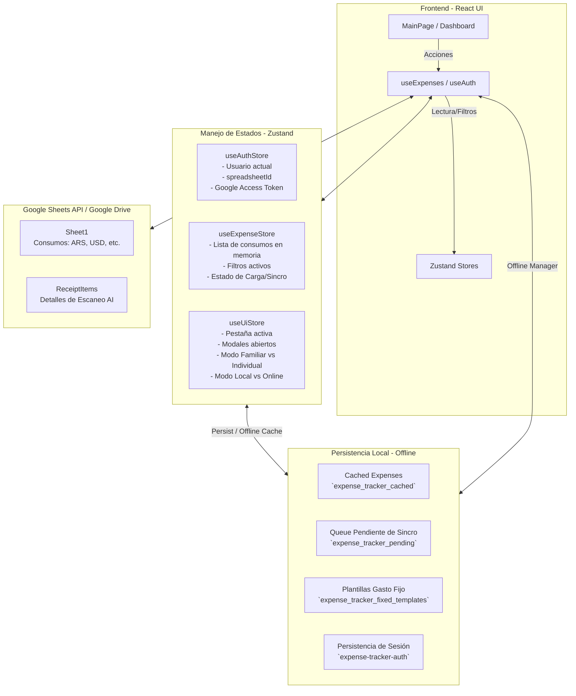
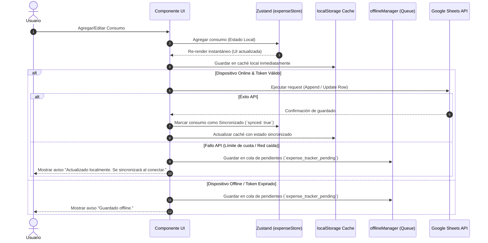

# Arquitectura y Flujo de Datos - Expense AI

Este documento describe de manera exhaustiva el funcionamiento interno de la aplicación: cómo se administran los datos, cómo se manejan los estados locales (Zustand), el almacenamiento local (localStorage), la integración con la API de Google Sheets y el funcionamiento del sistema multiusuario/familiar.

---

## 1. Mapa de Componentes y Almacenamiento

El flujo de información se divide en tres niveles clave:
1. **Frontend UI & Estado en Memoria (Zustand Stores)**.
2. **Almacenamiento Local Físico (localStorage)** para funcionamiento Offline/Caché.
3. **Base de Datos Externa (Google Sheets API)** como almacenamiento definitivo.



---

## 2. Flujo de Datos al Crear o Modificar un Consumo

Cuando cargas o editas un consumo, la app implementa una arquitectura **Offline-First**. Primero actualiza la interfaz localmente de manera inmediata para dar una experiencia fluida, y luego intenta guardarlo en Google Sheets en segundo plano.



---

## 3. Arquitectura de Grupos Familiares (Multiusuario)

El sistema de grupos familiares fue diseñado para ser **completamente descentralizado** (sin base de datos intermedia ni backend propietario). Se apoya exclusivamente en los permisos de Google Drive de los propios usuarios.

### ¿Cómo funciona la sincronización familiar?
1. **Spreadsheet Propietario (Creador):**
   El creador de la familia genera un grupo dándole un nombre (ej. "Familia Gómez"). El identificador de su hoja de Google Sheets (`spreadsheetId`) se convierte en el "ID de la Familia".
2. **Compartir Permisos:**
   Desde el modal de configuración, el creador introduce el correo Gmail de su familiar. La app hace una petición directa a la **Google Drive API** para otorgarle permisos de "Editor" a ese Gmail sobre ese archivo específico.
3. **Enlace de Invitación:**
   El creador genera un link con la siguiente estructura:  
   `https://app.url/?joinSpreadsheetId=SPREADSHEET_ID&familyName=Familia%20Gomez`
4. **Unión de Familiar:**
   Cuando el familiar abre ese enlace, la aplicación detecta los parámetros en la URL, guarda el `spreadsheetId` en su configuración local y activa el modo familiar.
5. **Lectura y Escritura Compartida:**
   A partir de ese momento, la app del familiar lee y escribe exactamente en la hoja del creador, en lugar de crear una hoja propia.
   
```mermaid
flowchart LR
    subgraph Owner [Creador de la Familia]
        OwnerApp[App Creador] -->|1. Comparte Permiso Drive| DriveAPI[Google Drive API]
        OwnerApp -->|2. Envía Enlace de Invitación| Link[/?joinSpreadsheetId=XXX]
    end

    subgraph Guest [Familiar Invitado]
        Link -->|3. Abre link en navegador| GuestApp[App Familiar]
        GuestApp -->|4. Guarda spreadsheetId en AuthStore| GuestStore[Zustand / LocalStorage]
    end

    GuestStore -->|5. Lee/Escribe datos| SharedSheet[(Google Sheet del Creador)]
    OwnerApp -->|5. Lee/Escribe datos| SharedSheet
```

---

## 4. Solución al Bug de Sincronización y Doble Login

### Problema Anterior:
1. Al expirar la sesión de Google OAuth (dura 1 hora), la app no sabía refrescar el token en segundo plano y redirigía al usuario a la pantalla de login.
2. Durante este re-login automático/One Tap, la app inicializaba temporalmente al usuario con `spreadsheetId: null`.
3. Esto obligaba a la app a buscar de nuevo en Google Drive un archivo llamado `'AI Expense Tracker'`.
4. En el caso del familiar invitado, la búsqueda no siempre encontraba el archivo compartido de forma instantánea. Al no encontrarlo, la app **creaba una nueva hoja de cálculo limpia** en su propio Drive. Como consecuencia, el familiar dejaba de ver los gastos compartidos del creador.

### Solución Implementada:
1. **Preservación de ID de Hoja:** Al inicializarse el proceso de re-auth, la aplicación valida si el usuario que está intentando re-logearse es el mismo que ya estaba en sesión. Si es así, **mantiene intacto su `spreadsheetId` guardado** (sin resetearlo a `null`).
2. **Reutilización del ID Existente:** En el callback de token de Google, la app prioriza el `spreadsheetId` que ya tiene en memoria. Solo si no tiene ninguno (usuario nuevo) llama a la API de Drive para buscar o crear una hoja nueva.
3. **Filtro de Carga en Segundo Plano (Silent Re-Auth):** Se modificó `App.tsx` para que, en lugar de arrojar al usuario a la pantalla de login cuando expire el token, muestre una pantalla de carga sutil ("Sincronizando sesión...") mientras refresca el token con Google de manera silenciosa. Si se refresca con éxito en menos de 6 segundos, el usuario entra directo a la app sin interrupción ni clics adicionales.
