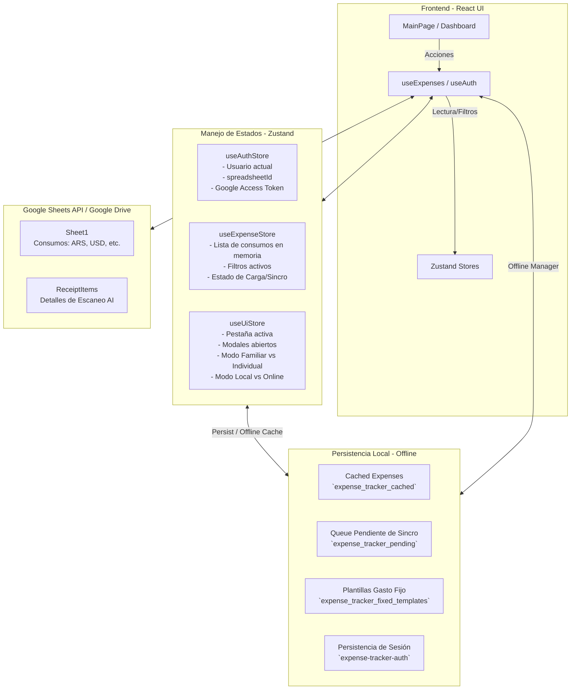
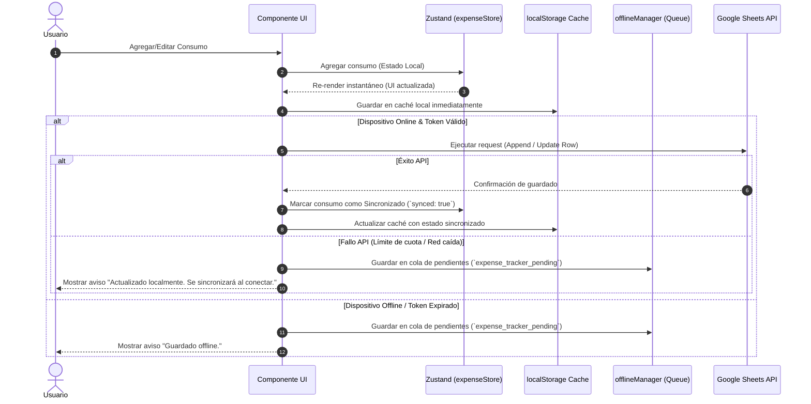

# Arquitectura y Flujo de Datos - Expense AI

Este documento describe de manera exhaustiva el funcionamiento interno de la aplicación: cómo se administran los datos, cómo se manejan los estados locales (Zustand), el almacenamiento local (localStorage), la integración con la API de Google Sheets y el funcionamiento del sistema multiusuario/familiar.

---

## 1. Mapa de Componentes y Almacenamiento

El flujo de información se divide en tres niveles clave:
1. **Frontend UI & Estado en Memoria (Zustand Stores)**.
2. **Almacenamiento Local Físico (localStorage)** para funcionamiento Offline/Caché.
3. **Base de Datos Externa (Google Sheets API)** como almacenamiento definitivo.

```mermaid
flowchart TD
    subgraph UI [Frontend - React UI]
        Main[MainPage / Dashboard] -->|Acciones| Hook[useExpenses / useAuth]
        Hook -->|Lectura/Filtros| Stores[Zustand Stores]
    end

    subgraph MemoryStores [Manejo de Estados - Zustand]
        authStore[useAuthStore\n- Usuario actual\n- spreadsheetId\n- Google Access Token]
        expenseStore[useExpenseStore\n- Lista de consumos en memoria\n- Filtros activos\n- Estado de Carga/Sincro]
        uiStore[useUiStore\n- Pestaña activa\n- Modales abiertos\n- Modo Familiar vs Individual\n- Modo Local vs Online]
    end

    subgraph LocalStorage [Persistencia Local - Offline]
        cache[Cached Expenses\n`expense_tracker_cached`]
        pending[Queue Pendiente de Sincro\n`expense_tracker_pending`]
        fixed[Plantillas Gasto Fijo\n`expense_tracker_fixed_templates`]
        authLocal[Persistencia de Sesión\n`expense-tracker-auth`]
    end

    subgraph ExternalDB [Google Sheets API / Google Drive]
        sheetMain[Sheet1\nConsumos: ARS, USD, etc.]
        sheetItems[ReceiptItems\nDetalles de Escaneo AI]
    end

    %% Relaciones
    Hook <--> MemoryStores
    MemoryStores <-->|Persist / Offline Cache| LocalStorage
    Hook <-->|Offline Manager| LocalStorage
    Hook <-->|Google API Requests| ExternalDB
```

---

## 2. Flujo de Datos al Crear o Modificar un Consumo

Cuando cargas o editas un consumo, la app implementa una arquitectura **Offline-First**. Primero actualiza la interfaz localmente de manera inmediata para dar una experiencia fluida, y luego intenta guardarlo en Google Sheets en segundo plano.

```mermaid
sequenceDiagram
    autonumber
    actor Usuario
    participant UI as Componente UI
    participant Store as Zustand (expenseStore)
    participant Local as localStorage Cache
    participant Offline as offlineManager (Queue)
    participant API as Google Sheets API

    Usuario->>UI: Agregar/Editar Consumo
    UI->>Store: Agregar consumo (Estado Local)
    Store-->>UI: Re-render instantáneo (UI actualizada)
    
    UI->>Local: Guardar en caché local inmediatamente
    
    alt Dispositivo Online & Token Válido
        UI->>API: Ejecutar request (Append / Update Row)
        alt Éxito API
            API-->>UI: Confirmación de guardado
            UI->>Store: Marcar consumo como Sincronizado (`synced: true`)
            UI->>Local: Actualizar caché con estado sincronizado
        else Fallo API (Límite de cuota / Red caída)
            UI->>Offline: Guardar en cola de pendientes (`expense_tracker_pending`)
            UI-->>Usuario: Mostrar aviso "Actualizado localmente. Se sincronizará al conectar."
        end
    else Dispositivo Offline / Token Expirado
        UI->>Offline: Guardar en cola de pendientes (`expense_tracker_pending`)
        UI-->>Usuario: Mostrar aviso "Guardado offline."
    end
```

---

## 3. Arquitectura de Grupos Familiares (Multiusuario)

El sistema de grupos familiares fue diseñado para ser **completamente descentralizado** (sin base de datos intermedia ni backend propietario). Se apoya exclusivamente en los permisos de Google Drive de los propios usuarios.

### ¿Cómo funciona la sincronización familiar?
1. **Spreadsheet Propietario (Creador):**
   El creador de la familia genera un grupo dándole un nombre (ej. "Familia Gómez"). El identificador de su hoja de Google Sheets (`spreadsheetId`) se convierte en el "ID de la Familia".
2. **Compartir Permisos:**
   Desde el modal de configuración, el creador introduce el correo Gmail de su familiar. La app hace una petición directa a la **Google Drive API** para otorgarle permisos de "Editor" a ese Gmail sobre ese archivo específico.
3. **Enlace de Invitación:**
   El creador genera un link con la siguiente estructura:  
   `https://app.url/?joinSpreadsheetId=SPREADSHEET_ID&familyName=Familia%20Gomez`
4. **Unión de Familiar:**
   Cuando el familiar abre ese enlace, la aplicación detecta los parámetros en la URL, guarda el `spreadsheetId` en su configuración local y activa el modo familiar.
5. **Lectura y Escritura Compartida:**
   A partir de ese momento, la app del familiar lee y escribe exactamente en la hoja del creador, en lugar de crear una hoja propia.
   
```mermaid
flowchart LR
    subgraph Owner [Creador de la Familia]
        OwnerApp[App Creador] -->|1. Comparte Permiso Drive| DriveAPI[Google Drive API]
        OwnerApp -->|2. Envía Enlace de Invitación| Link[/?joinSpreadsheetId=XXX]
    end

    subgraph Guest [Familiar Invitado]
        Link -->|3. Abre link en navegador| GuestApp[App Familiar]
        GuestApp -->|4. Guarda spreadsheetId en AuthStore| GuestStore[Zustand / LocalStorage]
    end

    GuestStore -->|5. Lee/Escribe datos| SharedSheet[(Google Sheet del Creador)]
    OwnerApp -->|5. Lee/Escribe datos| SharedSheet
```

---

## 4. Arquitectura de Sesiones Permanentes y Renovación Silenciosa de Token

### Problema Anterior:
1. Al expirar la validez del token de Google OAuth (que dura 1 hora), `App.tsx` evaluaba que la sesión no era válida (`!isTokenValid()`). Si el refresco silencioso no respondía en 6 segundos (por ejemplo por políticas de bloqueo de popups del navegador), la aplicación redirigía al usuario a la pantalla de login (`LoginPage`).
2. El usuario sentía que la sesión se cerraba sola todos los días o cada pocas horas.
3. Además, si el proyecto de Google Cloud estaba en modo "Testing", Google vencía los permisos cada 7 días obligando a re-aprobar el consentimiento.

### Solución Implementada:
1. **Sesión Permanente (Offline-First Real):** En [`App.tsx`](file:///mnt/c/js/proyects/my-expense-tracker/src/App.tsx), el acceso a la aplicación depende exclusivamente de si existe un objeto `user` guardado en `localStorage`. La app **nunca** se cierra sola ni redirige a la pantalla de inicio de sesión, permitiendo acceso inmediato e ininterrumpido a todos los gastos en caché, gráficos y formularios. Solo se sale de la app si el usuario hace clic explícitamente en "Cerrar Sesión".
2. **Refresco Silencioso en Segundo Plano:**
   - En [`authService.ts`](file:///mnt/c/js/proyects/my-expense-tracker/src/services/authService.ts) y [`useAuth.ts`](file:///mnt/c/js/proyects/my-expense-tracker/src/hooks/useAuth.ts), `requestAccessToken` envía el parámetro `hint: user.email` y `prompt: ''`. Esto le indica a Google qué cuenta autorizar sin desplegar el selector de cuentas ni pedir permisos de nuevo.
   - Se ejecuta un comprobador periódico cada 60 segundos y cada vez que el usuario vuelve a enfocar la pestaña del navegador (`visibilitychange` / `focus`), renovando el token 5 minutos antes de que expire.
3. **Botón de Reconexión No Intrusivo:**
   - Si por restricciones de seguridad del navegador el refresco silencioso en segundo plano requiriera un clic del usuario, la app muestra un discreto botón `⚡ Sincronizar Google` en la barra superior ([`Layout.tsx`](file:///mnt/c/js/proyects/my-expense-tracker/src/components/Layout/Layout.tsx)). Al presionarlo (gesto directo del usuario), el token se renueva en 1 segundo sin pedir permisos y sincroniza automáticamente las hojas de cálculo.
4. **Permisos Permanentes en Google Cloud:** Para evitar que Google pida aceptar permisos cada 7 días, el proyecto en Google Cloud Console debe estar publicado en estado **"In Production" (En producción)**.
